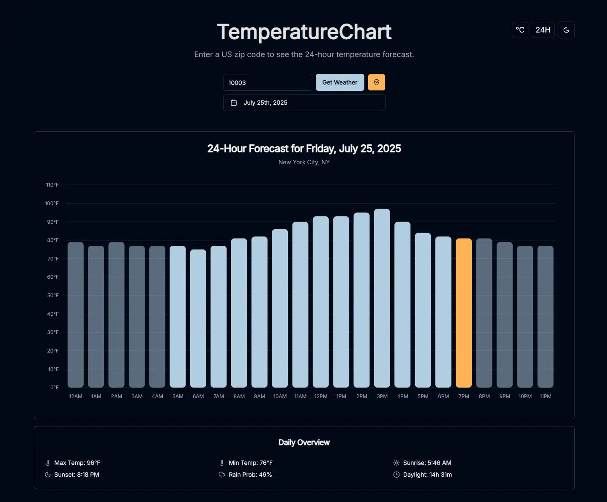

# TemperatureChart



## Overview

TemperatureChart is a minimalist web application designed to provide users with a clear and concise 24-hour temperature forecast. It focuses on delivering essential weather data without clutter, presenting hourly temperatures in an intuitive bar chart format. You can get data by providing a US zip code or by using your browser's geolocation.

## Features

- **Flexible Location Input**: Get weather data by either entering a US zip code or using your device's geolocation.
- **Date Selection**: View the forecast for the current day or select a different date using the calendar.
- **24-Hour Temperature Forecast**: View hourly temperature predictions in a clean bar chart.
- **Current Hour Highlighting**: The current hour's temperature bar is visually highlighted for the current day's forecast.
- **Day/Night Visualization**: The chart visually distinguishes between day and night hours.
- **Weather Icons**: At the base of each hour's bar, an icon represents the weather conditions (e.g., sunny, cloudy, rainy), with colors indicating intensity.
- **Detailed Tooltip**: Hover over chart bars to see detailed hourly data including temperature, apparent temperature, relative humidity, and precipitation probability.
- **Daily Overview**: A dedicated section displays daily metadata, including max/min temperatures, sunrise/sunset times, precipitation probability, and daylight duration.
- **Unit and Format Toggles**:
  - Switch between Fahrenheit and Celsius.
  - Choose between 12-hour (AM/PM) and 24-hour (military) time formats.
- **Responsive Design**: A clean, modern, and responsive user interface that works great on all devices.

## Usage

1.  **Provide a Location**:
    - Enter a 5-digit US zip code into the input field and click "Get Weather".
    - Alternatively, click the "Use My Location" button to allow the browser to use your current location.
2.  **Change the Date**:
    - Click the date button to open a calendar and select a different date for the forecast.
3.  **View the Forecast**:
    - The bar chart will display the hourly temperature forecast for the selected location and date.
    - Hover over any bar to see a detailed tooltip with more weather information for that hour.
4.  **Customize Units**:
    - Use the toggle buttons in the header to switch between °F/°C and 12/24-hour time formats. Your preferences will be saved in your browser.

## Technologies Used

- **Frontend**: Next.js, React, TypeScript
- **Styling**: Tailwind CSS, Shadcn/UI
- **Charting**: Recharts
- **APIs**:
  - Open Meteo API (for weather data)
  - Zippopotam.us API (for geocoding)
- **Package Management**: npm

## Getting Started

Follow these steps to set up and run the project locally:

1.  **Clone the repository**:
    ```bash
    git clone https://github.com/jjangsangy/TemperatureChart.git
    cd TemperatureChart
    ```
2.  **Install dependencies**:
    ```bash
    npm install
    ```
3.  **Run the development server**:
    ```bash
    npm run dev
    ```
    The application will be accessible at `http://localhost:9002`

## Project Structure

- `src/app`: Contains the main application pages, layouts, and global styles.
- `src/components`: Houses reusable UI components, including:
  - `src/components/ui`: Base components from Shadcn/UI.
  - `src/components/temperature-chart.tsx`: The main chart component.
  - `src/components/metadata.tsx`: The daily weather metadata component.
  - `src/components/footer.tsx`: The application footer.
- `src/lib`: Contains utility functions and external service integrations, such as `weather.ts` for API calls.
