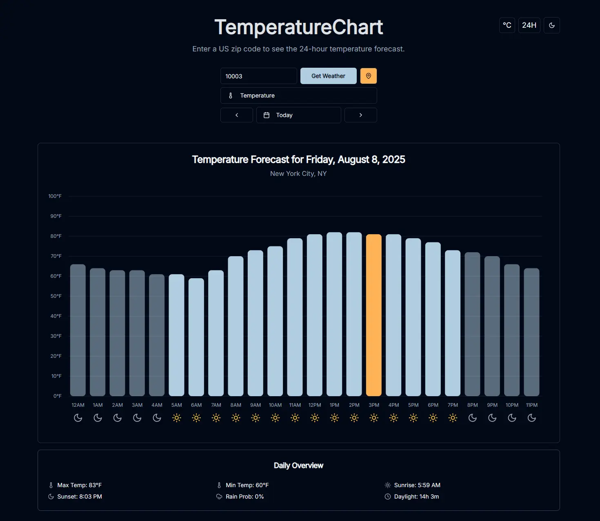

# TemperatureChart



## Overview

TemperatureChart is a minimalist web application designed to provide users with a clear and concise 24-hour temperature forecast for any specified US zip code. It focuses on delivering essential weather data without clutter, presenting hourly temperatures in an intuitive bar chart format. New features include visual day/night indicators, a toggle for Fahrenheit/Celsius units, and a toggle for AM/PM or 24-hour time format.

## Features

*   **Zip Code Input**: Easily enter a US zip code to get local weather data.
*   **24-Hour Temperature Forecast**: View hourly temperature predictions for the next 24 hours.
*   **Current Hour Highlighting**: The current hour's temperature bar is visually highlighted for quick reference.
*   **Day/Night Highlighting**: The chart visually distinguishes between day and night hours.
*   **Location Display**: See the city and state corresponding to the entered zip code.
*   **Fahrenheit/Celsius Toggle**: Switch between Fahrenheit and Celsius temperature units.
*   **AM/PM and 24-hour Time Format Toggle**: Choose between 12-hour (AM/PM) and 24-hour (military) time formats.
*   **Detailed Tooltip**: Hover over chart bars to see detailed hourly data including temperature, apparent temperature, relative humidity, and precipitation probability.
*   **Responsive Design**: A clean, modern, and responsive user interface.

## Technologies Used

*   **Frontend**: Next.js, React, TypeScript
*   **Styling**: Tailwind CSS, Shadcn/UI
*   **API**: Open Meteo API (for weather data)
*   **Package Management**: npm

## Getting Started

Follow these steps to set up and run the project locally:

1.  **Clone the repository**:
    ```bash
    git clone https://github.com/jjangsangy/TemperatureChart.git
    cd TemperatureChart
    ```
2.  **Install dependencies**:
    ```bash
    npm install
    ```
3.  **Run the development server**:
    ```bash
    npm run dev
    ```
    The application will be accessible at `http://localhost:9002`.

## Project Structure

*   `src/app`: Contains the main application pages, layouts, and global styles.
*   `src/components`: Houses reusable UI components, including `src/components/ui` for Shadcn/UI components, `src/components/temperature-chart.tsx` for the main chart, `src/components/metadata.tsx` for daily weather metadata, and `src/components/footer.tsx` for the application footer.
*   `src/lib`: Contains utility functions and external service integrations, such as `weather.ts` for API calls.
*   `src/hooks`: For custom React hooks.
